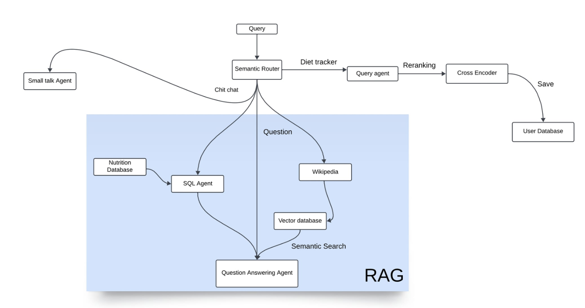

# Nutritional Advisor Chatbot

An intelligent AI-powered chatbot that provides personalized nutritional advice through dynamic few-shot prompting, semantic routing, and real-time data enrichment using Wikipedia. Designed to adapt to user preferences and handle ambiguous ingredient queries with ease.

---

## Key Features

- **Wikipedia API Integration**: Enriches ambiguous or uncommon food queries with real-time knowledge.
- **Semantic Routing**: Automatically routes user input to one of several specialized processing pipelines (e.g., Q&A, diet tracking).
- **Dynamic Few-Shot Prompting**: Selects relevant examples on the fly to improve prompt quality and model response accuracy.
- **Cross-Encoder Reranking**: Reranks final outputs to prioritize accuracy and context relevance.
- **LLaMA3-Powered Responses**: Utilizes the LLaMA3 language model for fluent, context-aware replies.

---

## Pipeline Overview

User queries are routed via a **Semantic Router**, which classifies input into one of three categories:

1. **Small Talk**  
   - Passed directly to LLaMA3 for a conversational reply.

2. **Nutritional Question Answering**  
   - Uses dynamic few-shot prompting to generate an SQL query based on the user input.
   - Queries a structured nutrition database for numerical data (e.g., calories, protein).
   - Simultaneously retrieves supplementary information via the Wikipedia API.
   - Both sets of information are combined and passed into LLaMA3 for response generation.

3. **Diet Tracking**  
   - Extracts food items and portion sizes from user input.
   - Retrieves nutritional data for the extracted items.
   - Uses a cross-encoder to rerank and select the most relevant match.
   - Saves the selected results into a user-specific tracking database.

---

## Setup Instructions
- Download [Ollama](https://ollama.com)  
- Run: `ollama pull llama3`  
- Install dependencies with `pip install -r requirements.txt`

#how to run: `streamlit run main.py`
